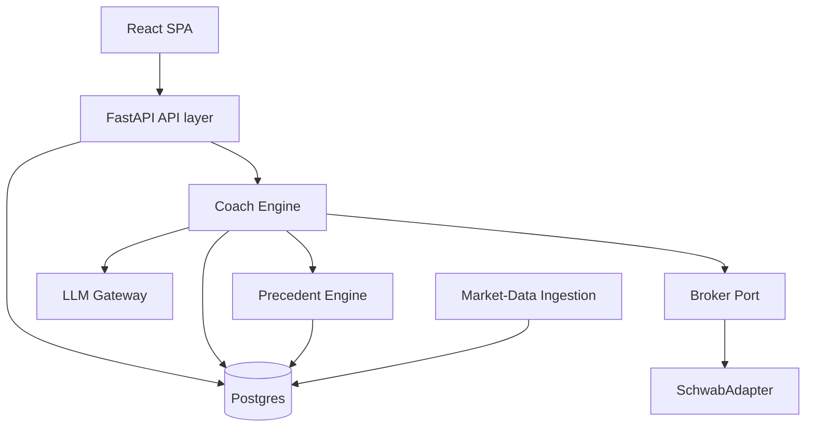
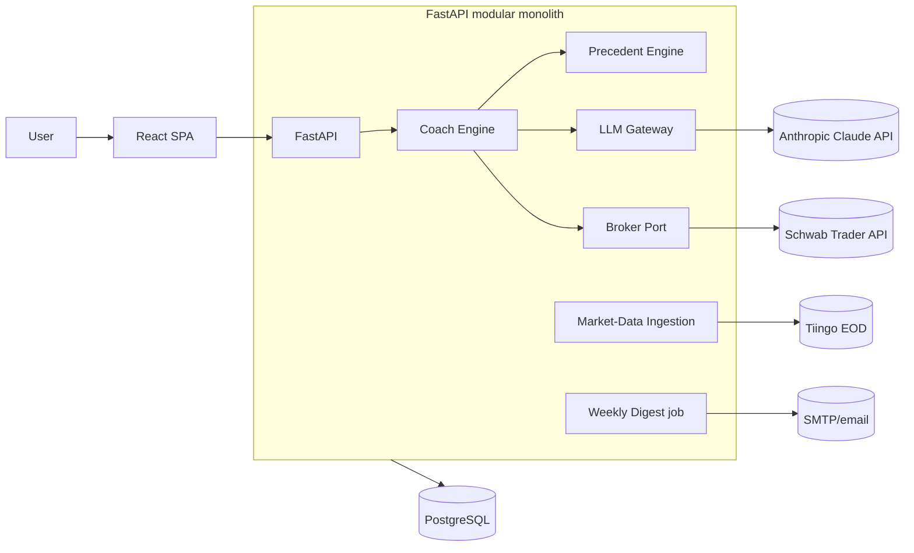
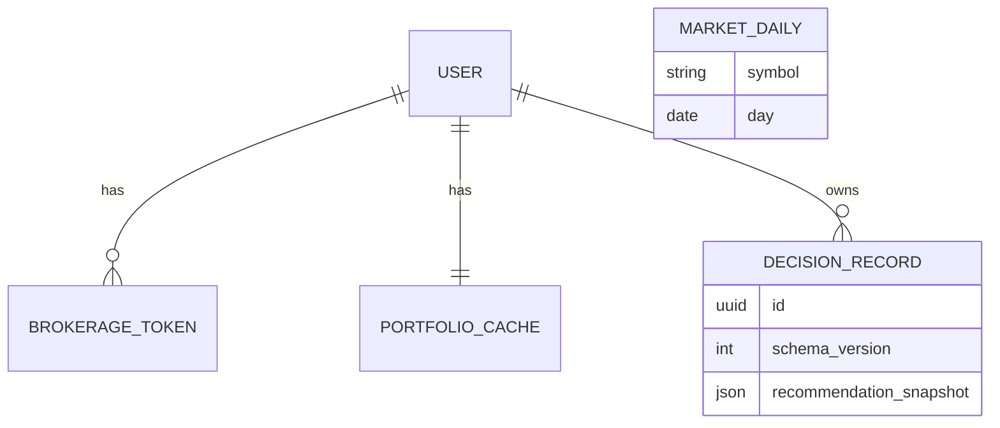

# Architecture Spine — Ballast

## Design Paradigm

**Modular monolith, hexagonal at the external edges.** One deployable FastAPI application, internally split into domain modules with one clear owner each. Every *external* dependency (brokerage, LLM, market data) sits behind a **port** (interface) with a swappable **adapter**. A thin React SPA is presentation-only; the backend owns all logic. Chosen for solo-buildability: one thing to run and debug, with the risky/changeable external integrations isolated and testable.

Module → directory map is under **Structural Seed**.

## Invariants & Rules

Dependency direction (who may depend on whom — inward only):



### AD-1 — Presentation/logic split is the enforcement boundary  `[ADOPTED]`
- **Binds:** all; UI + API layers; NFR2
- **Prevents:** the UI originating or surfacing any recommendation the backend did not build and bless.
- **Rule:** the React SPA is presentation-only and holds no business logic; it may only render data the FastAPI backend returns. All decision logic and invariant enforcement live server-side.

### AD-2 — A Recommendation is a validated structured object
- **Binds:** Coach Engine; FR7, FR12, FR13, FR14, FR18, NFR2
- **Prevents:** black-box output, missing-reasoning, missing-uncertainty, unbacked claims reaching the user.
- **Rule:** recommendations are produced by the pipeline `retrieve → compose → validate → surface` and carry required fields `{action_label, order_intent?, reasoning, evidence[], uncertainties[]}` — `action_label` is the human-readable call; `order_intent` (optional) is the typed executable payload `{symbol, side, amount}` handed to the Broker Port (AD-7/AD-13). A validation gate rejects any object missing reasoning, ≥1 real evidence record, or uncertainties; only passing objects may be returned. The LLM must emit this schema (structured output/tool-use). `reasoning` IS the just-in-time teaching (FR18) — one field, not a second subsystem.

### AD-3 — Precedent is code-retrieved and LLM-cited-only
- **Binds:** Precedent Engine, LLM Gateway, Coach Engine; FR13, FR15, FR19, FR20, NFR2
- **Prevents:** the LLM inventing or recalling statistics/history (hallucinated precedent).
- **Rule:** all factual market statistics come from the Precedent Engine as evidence records with stable IDs. The LLM receives retrieved evidence as input and may cite only IDs it was handed; the validator rejects any citation absent from the retrieved set. The LLM never computes or recalls a number. Prompt assembly and the citation-validity check are owned by the **Coach Engine** (not the LLM Gateway); the LLM Gateway only transports a typed request/response to Claude and applies a deterministic model-routing policy (Opus 4.8 for flagged hard-reasoning cases, Sonnet 4.6 otherwise).

### AD-4 — Two backing types; the strategy-backed default is always valid
- **Binds:** Coach Engine; FR7, FR15, PRD anxiety/omission invariants
- **Prevents:** a "no confident call" turning into a dead-end / do-nothing (omission-bias trap).
- **Rule:** evidence is either **event-precedent** (tactical, from the Precedent Engine) or **strategy** (the consistency / capture-not-beat base, always available). When no confident *special* call exists, the coach returns the strategy-backed **default plan** (make the regular index contribution / stick to plan) plus a plain reason why — never nothing.

### AD-5 — One immutable decision record powers recommend, co-sign, and replay
- **Binds:** Coach Engine, Postgres; FR16, FR17
- **Prevents:** divergent representations of "the decision" across features.
- **Rule:** on user approval the blessed Recommendation object (with its evidence + uncertainties snapshot) is persisted immutably as the decision record, carrying a `schema_version` so records stay replayable across schema changes. Co-sign = that record; replay = reading it back. No feature re-derives or mutates it.

### AD-6 — One owner per concern
- **Binds:** all backend modules
- **Prevents:** two modules writing the same state or reaching around an owner.
- **Rule:** Coach Engine is the sole writer of decision records; LLM Gateway is the sole caller of the Claude API; Precedent Engine is the sole source of market statistics; Broker Port is the sole path to brokerage state. No module bypasses an owner.

### AD-7 — Single execution path
- **Binds:** Coach Engine, Broker Port; FR8, FR9, FR22, FR23, NFR3
- **Prevents:** phantom/duplicate orders and out-of-band trading.
- **Rule:** every trade follows `propose → user-approve → Coach Engine → Broker Port → reconcile → persist outcome`. No other module places orders. Order rejection, partial fills, and timeouts are reconciled against the broker; the user always sees the true resulting state.

### AD-8 — External dependencies live behind ports
- **Binds:** Broker Port, LLM Gateway, Market-Data Ingestion; extensibility
- **Prevents:** vendor lock-in and coach logic coupling to Schwab/Claude/Tiingo specifics.
- **Rule:** the Coach Engine depends only on interfaces. Concrete adapters (SchwabAdapter, the Anthropic client, the Tiingo client) are swappable without changing coach logic.

### AD-9 — Coach/Guru seam (reserved, not built in v1)
- **Binds:** Coach Engine; PRD coach-is-boss invariant; deferred guru
- **Prevents:** a future guru bypassing gates or overriding coach authority.
- **Rule:** the future guru is a *suggestion source* that feeds INTO the same `propose → approve → bless` pipeline; it may never call execution directly, touch the core, or surface a recommendation that skips AD-2/AD-7. Concretely, it injects as a `SuggestionSource` at the pipeline's retrieve/compose stage — never at surface or execution. Reserve this boundary now.

### AD-10 — Per-user isolation; brokerage tokens are app-encrypted secrets
- **Binds:** API layer, Postgres, Broker Port; NFR1, NFR5
- **Prevents:** cross-user data leakage and DB-compromise token theft.
- **Rule:** all persistence goes through a scoped-repository layer that is **fail-closed** — a query without an explicit scope is an error, never all-access. User requests run under the authenticated user's scope; non-user contexts (market-data ingestion, digest, batch jobs) run under an explicit named SYSTEM/global scope. Brokerage OAuth tokens are encrypted at the application layer (AES/Fernet) with the key held outside the database (env/secret-manager); no user's data is used to serve another.

### AD-11 — Brokerage session lifecycle & degraded mode
- **Binds:** Broker Port, Coach Engine; NFR4, FR3, FR23
- **Prevents:** placing an order on a dead session; silent failure on token expiry.
- **Rule:** the ~7-day Schwab refresh-token expiry is tolerated with no data loss; on expiry the user is prompted to re-authenticate. Read/coach functions may continue in degraded mode, but execution requires a live session — an order is never placed on an expired session, and any approval→placement expiry forces re-auth + re-confirm before placing.

### AD-12 — Evidence Record Contract
- **Binds:** Precedent Engine, Coach Engine; AD-2, AD-3
- **Prevents:** two precedent features emitting incompatible evidence that then freezes into immutable records.
- **Rule:** every evidence record has a fixed shape `{id, kind: event-precedent|strategy, statement, stats{}, source, as_of}` with a stable ID. All producers emit this shape; the Recommendation validator (AD-2) and the decision snapshot (AD-5) depend on it.

### AD-13 — Broker Port Contract
- **Binds:** Broker Port, Coach Engine; FR9, FR22, FR23, NFR3
- **Prevents:** adapters returning divergent order results; duplicate orders on retry/timeout.
- **Rule:** the Broker Port exposes a normalized `OrderOutcome {status: filled|partial|rejected|timeout|pending, filled_qty, avg_price, broker_ref}` plus `get_order_status(idempotency_key)`. Every order carries a client idempotency key; retries reuse it so a timeout never places a second order. Reconciliation uses `get_order_status`, never optimistic assumptions.

### AD-14 — Portfolio cache is a single-writer projection
- **Binds:** Coach Engine, Broker Port, Postgres; FR5, FR6
- **Prevents:** a post-trade write racing the periodic refresh and corrupting portfolio truth.
- **Rule:** `PORTFOLIO_CACHE` is a read model with one writer; the broker is authoritative, and on any conflict a fresh broker reconciliation wins over optimistic local writes.

## Consistency Conventions

| Concern | Convention |
| --- | --- |
| Module naming | domain-named packages (`coach`, `precedent`, `brokers`, `llm`, `marketdata`, `digest`); interfaces suffixed `Port`, adapters suffixed `Adapter`. |
| IDs & dates | UUID primary keys; all timestamps ISO-8601 UTC. |
| Money | integer minor units or `Decimal` — never binary float. |
| API contract | JSON over REST; consistent error envelope; the Recommendation schema (AD-2) is the canonical coach output contract. |
| State mutation | decision records written only by Coach Engine; portfolio truth reconciled from the broker and cached read-only elsewhere. |
| Auth & secrets | JWT sessions via FastAPI-Users; secrets from env/secret-manager; brokerage tokens encrypted at rest (AD-10). |
| Data sourcing | market data only via the Precedent Engine over `market_daily`; never `yfinance` in production. |
| Logging | structured logs; never log secrets or raw tokens. |

## Stack

| Name | Version |
| --- | --- |
| Python | 3.12+ |
| FastAPI | 0.136 |
| FastAPI-Users | 15.x |
| React | 19.2 |
| Vite | 8.x |
| PostgreSQL | 18 |
| schwab-py (alexgolec) | 1.5.1 |
| Anthropic Python SDK | pin latest minor |
| Claude model | `claude-sonnet-4-6` (default) / `claude-opus-4-8` (hard reasoning) |
| Market data | Tiingo (EOD; Stooq backup) |

## Structural Seed

Container view:



Core entities:



`DECISION_RECORD.recommendation_snapshot` embeds the immutable evidence + uncertainties (AD-5); precedent is computed from `MARKET_DAILY` at decision time and snapshotted, not re-derived later.

Source tree:

```text
ballast/
  frontend/            # Vite + React 19 SPA (presentation only)
  backend/
    api/               # FastAPI routes, auth (FastAPI-Users), sessions
    coach/             # Coach Engine: recommendation pipeline + decision records
    precedent/         # Precedent Engine: drawdown matching, missed-growth (over market_daily)
    llm/               # LLM Gateway: Anthropic SDK, structured output, model routing
    brokers/           # BrokerPort (interface) + schwab_adapter/
    marketdata/        # Tiingo ingestion job
    digest/            # weekly email job
    db/                # models, migrations, app-layer encryption
```

## Capability → Architecture Map

| Capability / Area | Lives in | Governed by |
| --- | --- | --- |
| Accounts & onboarding (FR1–FR4) | `api` (auth), `brokers`, `coach` | AD-1, AD-10, AD-11 |
| Portfolio visibility (FR5–FR6) | `coach`, `brokers`, `db` | AD-6, AD-7 |
| Propose-and-approve + execution (FR7–FR11, FR22, FR23) | `coach`, `brokers` | AD-2, AD-7, AD-11 |
| Reasoning / precedent-backed / flag-unknowns (FR12–FR14) | `coach`, `llm`, `precedent` | AD-2, AD-3 |
| Recovery-precedent, missed-growth, headline context (FR15, FR19, FR20) | `precedent` | AD-3, AD-4 |
| Co-sign & replay (FR16–FR17) | `coach`, `db` | AD-5 |
| Just-in-time teaching (FR18) | `coach` | AD-2 |
| Weekly digest (FR21) | `digest` | AD-6 |
| Security & isolation (NFR1, NFR5) | `api`, `db` | AD-10 |
| Structural trust enforcement (NFR2) | `coach` | AD-2, AD-3 |
| Execution reliability / session reality (NFR3, NFR4) | `coach`, `brokers` | AD-7, AD-11 |
| Coach voice & tone (NFR8) | `llm`, `coach` | AD-2 |

## Deferred

- **The Guru** (paper-sim, then configurable capped real-money satellite): the seam is reserved (AD-9) but nothing is built in v1.
- **Event-category tagging** for precedent: v1 is drawdown-based only; a curated event taxonomy is a later enrichment.
- **Later features:** strategy curriculum (#10), literacy quiz (#11), agreement-based progression (#13), karate-belt tiers (#14), "you take the reins" (#12).
- **Push/SMS notifications; going-to-market (monetization, marketing, scale):** out of v1.
- **Deployment / hosting & environments:** not yet decided — single-app deploy target, secret-manager choice, and env topology to be set before first deploy. `[ASSUMPTION]` single-region, single-instance is adequate for v1's audience.
- **Design-detail thresholds:** exact drawdown-band definition, the small v1 fund set, contribution-scheduling model, and SM3 confidence-measurement cadence — resolved in UX/build, not spine-level.
